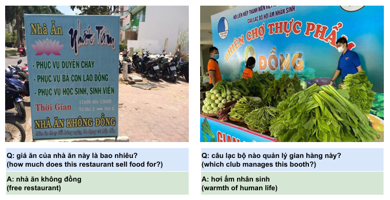

ViTextVQA: Vietnamese Text-based Visual Question Answering
=====

# ViTextVQA Dataset

Welcome to ViTextVQA (Vietnamese Text-based Visual Question Answering) dataset! This dataset is the first high-quality large-scale dataset in Vietnamese specializing in understanding text appearing in images.

## Overview

ViTextVQA contains over 16,000 images and over 50,000 questions with answers. The dataset is designed to evaluate the ability of AI models to comprehend text within images and answer questions based on that understanding.

## Purpose

The purpose of ViTextVQA is to provide a benchmark for evaluating the reading comprehension ability of Visual Question Answering (VQA) models in the Vietnamese language. As a developing country, Vietnam is still in need of resources and benchmarks to advance research in AI and machine learning.

## Key Features

- 16,762 images
- 50,342 questions with answers
- Focus on understanding text within images
- Meticulously crafted to ensure diverse and challenging questions

## Importance of ViTextVQA

Understanding text in images is crucial for many real-world applications, such as assisting visually impaired individuals, enhancing image search engines, and improving AI's understanding of multimedia content. ViTextVQA fills a crucial gap by providing a large-scale dataset tailored to the Vietnamese language.

## Usage

Researchers and developers can use ViTextVQA to train and evaluate their VQA models, analyze the performance of different approaches, and contribute to advancing research in this field. The dataset is freely available for research purposes.

## Contributions

- Create the first high-quality large-scale dataset for text-based VQA task in Vietnamese, focusing on scene text and text appearing in the image.

- Analyze the challenges of the ViTextVQA dataset by evaluating the performance of the OCR system.

- Through our extensive experiments, we found that the T5-based methods behave as the answer selector methods when scene texts are suffixed questions.

- Our experiments showed the effectiveness of arranging from top-left to bottom-right, resulting in remarkable enhancements in the performance.

## Availability

The ViTextVQA dataset will be available for download after our article is accepted.

You can find it at the following link: [ViTextVQA Dataset](link)

## Citation

If you use ViTextVQA in your research, please cite our preprint:

[Authors. "Title of the Paper." Conference/Journal Name, Year.](link)

## Authors

- Quan Van Nguyen
  - Email: [21521333@gm.uit.edu.vn](mailto:21521333@gm.uit.edu.vn)

- Dan Quang Tran
  - Email: [21521917@gm.uit.edu.vn](mailto:21521917@gm.uit.edu.vn)

- Huy Quang Pham
  - Email: [21522163@gm.uit.edu.vn](mailto:21522163@gm.uit.edu.vn)

- Thang Kien-Bao Nguyen
  - Email: [21521432@gm.uit.edu.vn](mailto:21521432@gm.uit.edu.vn)

- Bs Nghia Hieu Nguyen
  - Email: [nghiangh@uit.edu.vn](mailto:nghiangh@uit.edu.vn)

- PhD Kiet Van Nguyen
  - Email: [kietnv@uit.edu.vn](mailto:kietnv@uit.edu.vn)

- Assoc. Prof Ngan Luu-Thuy Nguyen
  - Email: [ngannlt@uit.edu.vn](mailto:ngannlt@uit.edu.vn)

### Affiliations

- Faculty of Information Science and Engineering, University of Information Technology
- Vietnam National University, Ho Chi Minh City, Vietnam

## Contact

For any inquiries or feedback regarding the ViTextVQA dataset, please contact  [21521333@gm.uit.edu.vn](mailto:21521333@gm.uit.edu.vn) or [haryquan.minh@gmail.com](mailto:haryquan.minh@gmail.com).

Thank you for your interest in ViTextVQA! We hope this dataset contributes to the advancement of research in text-based Visual Question Answering in Vietnamese.